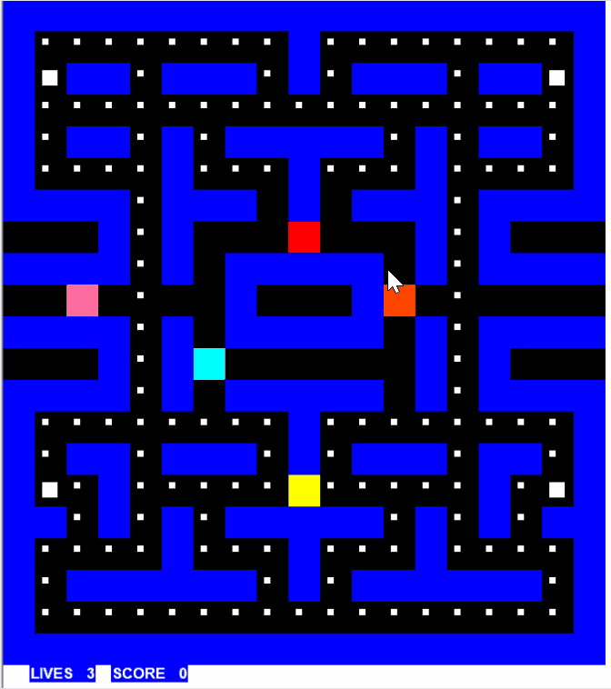
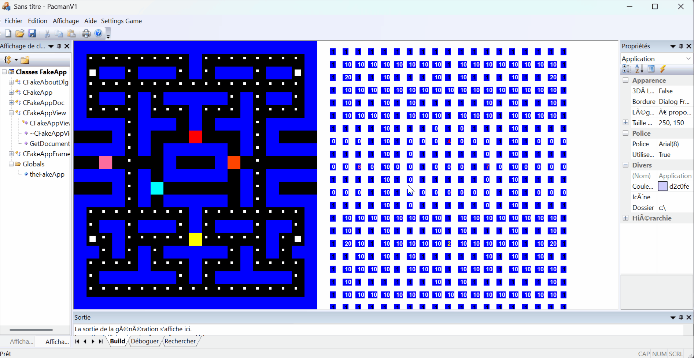
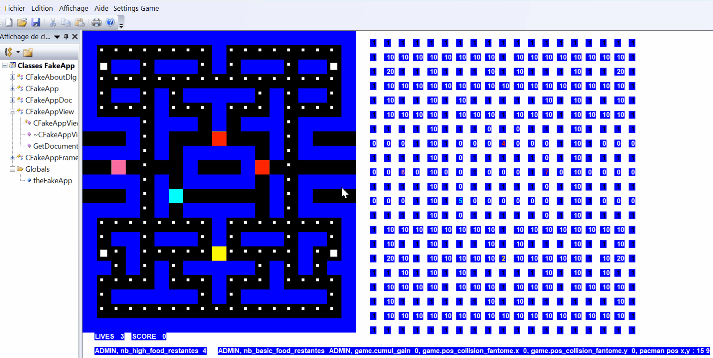

# **Pacman Microsoft Fundation Class** 

👋 Hi there! This is my first project in C++. It was a project for class. 
They asked to design a pacman game (no graphics) with dialog box (that's why we used MFC). 

## **Summary**

For the design I wanted to code the movement in discrete and then use interpolations, 
but unfortunately that was an unnecessarily complicated idea. 

I also intended to add some extra elements but I didn't have the courage to finish it afterwards ahahah. 
These elements included teleporters, special powers (strong pacman to break walls, added speed...). 

I've named this repo **PacmanV1** in case I finish it one day on another framework. 

## 🚀 **Launch the Project**

To run PacmanV1 on your machine:
1. Install Visual Studio (Community Edition) with the following workloads:
    - C++ MFC for latest Build Tools (`v143`)
    - Windows SDK `10.0.x`
    - MSVC v143 toolset
2. Open the solution file `PacmanV1.sln` in Visual Studio.
3. If prompted to retarget the project, choose:
    - SDK version: `10.0` (latest installed)
    - Platform toolset: `v143`
4. Build and run:
    - Press Ctrl + F5 to launch the game (Release or Debug mode). ℹ️ If you're new to MFC: the application will auto-launch from `PacmanV1App`, which opens the `MainFrame` and displays the `PacmanV1View`. No manual execution is needed from the ClassView.
  
📷 *Screenshots and setup help available in the `Documentation/` folder.*

---
---

🇫🇷 Ci-dessous, vous trouverez le rapport de projet complet que j'avais rédigé à l'époque (en français) à quelques reformulations près.   
Il décrit en détail le fonctionnement du jeu, les choix techniques, les bugs rencontrés et mes idées d’évolution.

---

# 📄 Rapport de Projet d’IHM : Pac-Man

🔧 Note : Ce projet visait la logique de jeu et non l’apparence graphique. Le moteur est minimaliste mais fonctionnel. 

🔧 Mode debug activé (visualisation des états internes, utilisé pour le développement et le test des collisions). 

🔧 Boîte de dialogue — fonctionnalité partiellement implémentée.  Il est préférable de modifier les variables directement dans le code, mais j’ai inclus cette démo pour montrer les contrôles disponibles.  
🕒 Pour l’horloge : plus la valeur est faible, plus Pac-Man se déplace rapidement (de mémoire).  La modification prend effet après un game over.  
⚠️ Je n’ai pas eu le temps de finaliser cette fonctionnalité, mais je tenais à l’inclure dans la démonstration.  

*Seatech – 2024*  
*0wI* 

## 📚 Sommaire

- [Chapitre 1 : Introduction](#chapitre-1--introduction)
- [Chapitre 2 : Architecture & Classes](#chapitre-2--objectifs-choix-de-programmation-architecture-structure-de-classe)
- [Chapitre 3 : Échéancier](#chapitre-3--echeancier-de-réalisation)
- [Chapitre 4 : Travail réalisé](#chapitre-4--travail-réalisé-test-pour-la-validation-du-code-problème-rencontrés-description-de-la-structure-des-programmes)
- [Chapitre 5 : Conclusion](#chapitre-5--conclusion-etat-final-du-projet-points-fort-points-faibles)

## Chapitre 1 : Introduction

### Définition du logiciel voulu

Le logiciel voulu se veut être un clone de Pac-Man avec quelques options supplémentaires. Tout d’abord, puisqu’il s’agit d’un projet MFC, je souhaite ajouter une Boîte de dialogue qui permettent de gérer quelques paramètres du jeu (affichage, modifications de variables…). Par ailleurs, si les premières étapes (clone & boîte de dialogue) sont totalement achevées, je voudrais ajouter des pouvoirs spéciaux supplémentaires « Pac-Man Glouton » qui peut manger les murs et portail que j’appelle Clap-Trap qui apparaît et disparaît au cours du jeu et qui permet donc téléporter Pac-Man (ou même n’importe quelle créature du jeu) à la manière d’un portail comme dans portal 1 & 2. 

## Chapitre 2 : Objectifs, Choix de programmation, Architecture, Structure de Classe.

### Structure des classes

La structure du logiciel est détaillée dans le document Doxygen ci-joint. J’y reviens par ailleurs dans la suite du rapport. Globalement :

- La classe `PacmanV1View` contient un objet `game` de la classe `GameManager` (Moteur du jeu)
- La classe `GameManager` contient plusieurs objets : `pacman`, fantômes (`Blinky`, `Inky`, `Pinky`, `Clyde`), `graph`
- `graph` est une instance de la classe `Matrix` qui représente la carte du jeu (une matrice)
- `pacman` est un objet de la classe `CPacman`, classe fille de `Entity`
- Un fantôme est un objet de la classe `Cphantom`, classe fille de `Entity`
- `pos` est une classe pour gérer des positions (return x,y)
- La classe `CBoiteSettings` gère la boîte de dialogue permettant de modifier les paramètres du jeu

### Planification – Découpage du travail

La planification se fait par l’analyse global des besoins du jeu, mais aussi au fur et à mesure lorsque l’on applique des correctifs (car on ne sait pas tout lorsque l’on n’a pas commencé). J’ai utilisé GitHub comme journal de bord : l’historique des commits documente chaque étape du développement, avec les bugs identifiés, leurs résolutions, et les améliorations apportées. On peut ainsi retracer l’évolution complète du projet.  

Sur la planification initiale en elle-même, on commence par afficher une carte vierge qui contient juste les blocks, puis on affiche Pac-Man, on lui ajoute les mouvements (ainsi que les commandes de déplacement), la capacité de manger la nourriture (et par là même augmenter le score), puis on ajoute les fantômes (déplacement, interactions avec la nourriture). On ajoute ensuite un déroulement au jeu (morts, modifications progressive de la difficulté à chaque level (par exemple, vitesse des entités, comportement, etc.), reset du jeu, réinitialisation…) pour ensuite pouvoir gérer les interactions Pac-Man & Fantômes (perte d’une vie en cas de contact). On ajoute ensuite le cas où Pac-Man peut attaquer les fantômes (d’où l’intérêt de faire les fantômes et la nourriture avant) et les manger (score déjà présent, donc modifiable). 

Enfin, on ajoute la boîte de dialogue. Il faut aussi penser à une méthode d’interpolation éventuelle pour permettre à Pac-Man d’avancer de manière continue (ou du moins d’en donner l’illusion). On ajoute pour finir les pouvoirs listés en introduction. 

## Chapitre 3 : Echéancier de réalisation. 

Je me suis volontairement fixé des objectifs additionnels (boîte de dialogue, pouvoirs supplémentaires) par rapport à un « clone » de Pac-Man dans l’éventualité où j’arriverai à la fin. L’avantage, c’est que ces deux ajouts finaux des dispensables pour la réalisation du jeu. Ainsi, mon objectif est d’arriver à terminer une version semblable à celle du jeu Pac-Man (affichage des textures et des sprites non compris) et éventuellement d’ajouter la boîte de dialogue. Pour, les pouvoirs, je ne pense pas que ce sera atteignable, et ce d’autant plus que, la complexité du code augmente à mesure que l’on avance (ce qui signifie qu’un petit ajout au début est beaucoup moins couteux en temps et en énergie qu’à la fin où l’on doit envisager les répercussions d’un ajout ou d’un autre sur le jeu : c’est là que viennent les bugs : un comportement imprévu qui va donc effectuer une action contre-intuitive pour le joueur). 

## Chapitre 4 : Travail réalisé, test pour la validation du code, Problème rencontrés, description de la structure des programmes. 

Dans la suite du document je vais essayer d’expliquer au maximum le code c’est-à-dire sa structure (on peut aussi regarder le document Doxygen), les idées développées, les bugs rencontrés et leurs corrections (ils sont surtout listés et expliqués dans chaque commit sur GitHub). Cette liste est bien sûr non-exhaustive, elle permet surtout d’introduire à la lecture du code qui est commenté ici et là. Par ailleurs, à chaque commit sur le GitHub j’ai laissé des commentaires pour expliquer ce qui a été effectué.  
GitHub : https://github.com/JulienDesdo/PacmanV1  

Contrôles : utilisez les flèches du clavier pour diriger Pac-Man. Une boîte de dialogue "Settings Game" est accessible à côté du menu "Aide" au lancement du jeu.
ℹ️ Pour bien utiliser cette boîte, pensez à lire la note en fin de rapport.

### La Carte 

Pour concevoir un jeu de l’ère 8 bits qui n’a pas une structure trop complexe il faut visualiser le type de données avec lequel on souhaite travailler. J’ai choisi de modéliser la carte par une matrice. Les coordonnées de la matrice repèrent la position de l’objet (un block, un fantôme, un Pac-Man, de la nourriture…) sur la carte et la valeur associé à ces indices l’entité représenté en ce point. Ainsi la valeur 1 représente un block, la valeur 2 l’objet pacman, la valeur 0 une case vide…  

Pour créer la map, j’ai dû fabriquer une classe « matrix ». Une matrice est simplement un tableau et je joue sur les indices pour lui donner une forme matricielle. Les méthodes get_value(i,j) et set_value(i,j,value) permettent donc de faire comme si le tableau data était une matrice (sans avoir recours à des objets plus complexes de bibliothèques c++). Je crée une méthode d’initialisation qui fait des set_value 1 ou 0 aux bons endroits pour créer une map. 

Naturellement, on n’affiche pas une matrice dans view mais on positionne chaque point auquel on associe un rectangle d’un couleur déterminé par la valeur contenu à la position (i,j). Ainsi si graph.get_value(i,j) vaut 1, on affiche un carré bleu, et si cela vaut 0 un carré noir. La carte est donc initialisée.  

***Commentaire**: Bien que, a posteriori, je recoderais plutôt la chose sans données discrètes, je trouvais au départ assez judicieux d’employer un structure type matrice pour : l’utilisation d’algorithmes spécifiques comme Astar pour les fantômes, la facilité pour coder un mouvement et des collisions sans hit-box entre autres. Cela dit, on pourra toujours ajouter de l’interpolation pour donner l’illusion d’un mouvement continu.* 

### Le déplacement de Pac-Man 

Le principe est simplement de générer un 2 dans la matrice et de le faire se déplacer sur la matrice. 
Il faut donc créer une entité Pac-Man. Puisque l’on sait que l’on devra créer une entité fantôme, on crée donc une classe mère Entity donc la classe CPacman héritera. Cela permet entre autres d’écrire une seule fonction move, un seule fonction collision… Bref, d’écrire des fonctions plus générales. Les attributs de Entity qui importent ici sont les coordonnées (i,j) (coordonnées dans la matrice). 

Comme il sera parfois nécessaire de retourner une position (c’est à un return x,y) mais que l’on ne peut pas écrire « return A1,A2… » mais simplement « return A », on crée une classe pos qui  possèdent les attributs x,y et on la munit des méthodes classiques (constructeurs surchargés ou non, destructeur…). 

On peut déjà ajouter une classe « game » qui est le moteur du jeu et gère donc l’initialisation (constructeur) mais aussi les interactions entre les entités du jeu. On écrit move dedans. Puis on « encapsule » move en ajoutant des fonctions left,right,down,up pour éviter d’avoir à écrire la position suivante pour faire bouger une entité. Un mouvement, c’est la valeur précédente qui est remplacé par un 0 dans le graph et par un 2 (Pac-Man) dans la « new_pos » (en argument de move) du graph. 
En ce qui concerne l’affichage, il faut écraser le dessin précédent et le remplacer par le dessin suivant (par exemple où pacman a bougé via game.left(pacman)) en utilisant un timer dans lequel on spécifie l’instruction du mouvement. Le timer se trouve dans OnDraw. 

On utilise également la fonction Bool CpacmanV1View ::PreTranslateMessage pour gérer les inputs du clavier (j’ai choisi les flèches à côté du numpad). On garde en mémoire les touches enfoncés grâce à la variable dir, qui permet également de maintenir l’avancement de pacman dans une direction tant que l’on n’appuie sur aucune autre flèche. 

***Commentaire** : Effectivement, on aurait pu à ce moment concevoir Entity comme « tous les objets présents sur la map » (blocks, vide, nourriture) puis faire une classe fille Creature (qui contient pacman, fantômes), une classe fille Food, une classe fille Block…
Mais je me suis un peu hâté dans l’idée de faire un code fonctionnel, car je pense qu’on ne fait un code bien propre que lorsque l’on a acquis de l’expérience avec un code fonctionnel. La preuve, puisque je me suis fait la réflexion quand j’étais bien plus avancé dans le code.* 

### Les collisions
Il s’agit simplement de vérifier à chaque déplacement (donc à chaque appel de la fonction move, d’où « l’encapsulation » dont j’ai parlé ci-dessus) si position suivante sur le graph possède ou non une valeur 1 dans la matrice. Si l’on a une valeur 1 alors, il n’y pas de déplacement, sinon il y en a un.  

### Fantômes 
Les fantômes font parti de la classe Cphantom qui est une classe fille de Entity. Il y a 4 fantômes : Blinky (rouge), Inky (cyan), Pinky (rose), Clyde (orange) qui ont des entity_id (respectivement 4,5,6,7) qui permettent de les reconnaître quand on les passe en paramètre de move par exemple.  

### La Nourriture
On attribue un numéro à la nourriture basic et « super ». Lorsque Pac-Man active la fonction move, on ajoute le cas où la valeur de pos_new dans le graph vaut la valeur de basic_food ou high_food. 

On ajoute la fonction reset_food qui s’active lorsqu’il n’y plus de nourriture sur le terrain. 

Pour détecter cela (pas de nourriture sur le terrain), soit l’on instaure un compteur qui à chaque ingestion diminue pour arriver à 0, soit l’on boucle sur le graph et l’on recompte la nourriture à tour. Bien que la complexité de la deuxième méthode soit plus grande, je l’ai finalement utilisé au détriment de la première car des bugs collisions entre entités supprimait de la nourriture au moment d’un game_reset (pacman meurt mais son compteur de vie n’est pas nul, donc il respawn avec la nourriture présente sur le terrain ; Mais la case de collision [ce serait long à expliquer, mais c’est une question d’ordre de chevauchement des chiffres dans les cases, compliqué à corriger sauf si on change le type de données : donc tout le programme, mais à ce stade (voir github), ce n’était plus trop faisable, j’ai donc opté pour un patch…] va effacer une nourriture sans la décompter)). 

Quand toute la nourriture est mangée, on ajoute un niveau (cela permettra ensuite d’avoir un déroulement du jeu, fantôme qui sortent, vitesse qui augmente…). 

Un problème se pose : comment faire pour que les fantômes ne gomment pas la nourriture ? Eh bien, on fait du cumul de valeurs dans la matrice. Ainsi si la nourriture basique est repérée par 10 et la high Food par 20, on somme la valeur du fantôme (4,5,6,7) avec celle de la nourriture. Lorsque le fantôme se déplace on peut donc restaurer l’état précédent de la case en faisant une soustraction de la valeur du fantôme à la valeur de la case précédente. Pour actualiser la case vers laquelle il se dirige, on acquière la valeur de la case suivante (get_value(pos_new.x,pos_new.y)) et on ajoute la valeur du fantôme (entity_id). 

### Les Interactions du jeu 
Il s’agit ici principalement de traiter le interactions Pac-Man/fantômes, Food/Pac-Man, Pac-Man/special_food/fantômes, prison pour les fantômes, … 

#### Pac-Man/fantômes
On la différence de position selon x et y des entités Pac-Man & fantôme concerné. S’il s’avère que Pac-Man collisionne avec un fantôme, on active le Game Reset. 

#### Food/Pac-Man 
Pour la basique Food, je l’ai déjà expliqué. Pour high Food, il faut activer une horloge dès lors que Pac-Man rencontre cette nourriture 
Le problème qui se posait était celui du cumul des high Food (c’est-à-dire si Pac-Man absorbe une autre high Food alors que l’on a toujours state fantôme = 1) où il fallait faire alors faire [temps restant première high Food + temps ajouté par nouvelle high Food ingérée]. J’ai alors ajouté une variable nombre high Food ingérée en même temps qui permet de résoudre ce problème. 

Quand state fantôme vaut 1 (= fantômes vulnérables), le fantôme sont alors vulnérables et on ajoute des test collisions Entity / Entity qui impliquent le Respawn des fantômes dans ce cas. 

#### Prison pour les fantômes
Comme les fantômes ont un temps assigné en prison différent les uns des autres puisqu’ils ont été mangés à des moments distincts, on leur attribue chacun une horloge différente. Puis pour éviter les collisions entre fantômes dans la prison centrale, et trouver un endroit où mettre Blinky (le fantôme rouge, car il n’y a que 3 places dans la prison centrale), j’ai mis les prisons dans les 4 x 2 carrées noirs sur la cotés gauches et droits de l’écran de jeu. 

***Commentaire**: Je n’ai pas mis la fonction qui permet de faire en sorte que quand le fantôme sorte de prison, il passe à state fantôme = 1 ; Il faudrait pour cela ajouter un state fantôme spécifique à chaque fantôme. Le fait de ne pas avoir codé cela implique que des fantômes, alors même qu’ils sont sortis de prison peuvent ressortir vulnérables si le chrono associé à state fantôme n’est pas terminé (dans le vrai jeu Pac-Man, cette situation n’existe pas).*

### Déroulement du jeu 
Le déroulement du jeu s’effectue via les méthodes Add_level, Game_reset, qui permettent de mettre à jour l’état du jeu. Ainsi quand Pac-Man meurt, selon que life_nbr > 0 ou < 0, on reset ou non entièrement le jeu. Jourlevel se déclenche quand toute la nourriture a été mangé et met à jour les fantômes actifs ou non, les comportements des fantômes. Il y aussi appel de la fonction Respawn, qui va faire Respawn les fantômes différemment en fonction de s’ils sont inactif ou non, s’ils ont été absorbés par Pac-Man (dead = true, alors prison).  

### Téléporteur
Lorsque Pac-Man, arrive à la position spécifique (à droite ou à gauche) du téléporteur, on emploie move pour le déplacer. Quand Pac-Man passe à droite de l’écran, il se retrouve à gauche en allant vers la droite (la direction est inchangée). De même dans l’autre cas (mais la direction va être « gauche »). 
On peut faire de même pour les fantômes. On ajoute les mêmes conditions dans la partie fantôme de la fonction move. 

***Commentaire** : Cela dit, je n’ai pas fait en sorte que les fantômes envisagent le téléporteur comme une route (c’est dû à l’algorithme de poursuite des fantômes). Donc l’algorithme du fantôme peut utiliser le téléporteur mais n’en comprend pas la portée : Ainsi, si Pac-Man se trouve tout à droite de la carte et le fantôme tout à gauche à coté du téléporteur, il ira en fait à droite…*

### Mode Administrateur & Paramétrage (Tests & débogage) 
L’augmentation de la complexité du code avec sa taille m’ont forcé à réaliser des « outils » de débogage pour visualiser l’évolution du jeu. Ainsi j’affiché directement la matrice avec les numéros pour pouvoir comprendre ce qu’il se passait quand les collisions entre deux entités échouaient. J’ai aussi ajouté la visualisation de variables supplémentaires. Manuellement, on peut ajouter un ! devant la condition game.admin dans le Timer de la View pour activer la vue admin ou non. 

J’ai par ailleurs décidé d’ajouter une boite de dialogue pour modifier la vitesse du jeu, l’affichage, les niveaux entre autres. 

### Ajouts que je comptais faire. 
Un des ajouts initialement prévus était que Pac-Man ait des pouvoirs spéciaux qui n’existent pas dans le jeu d’origine. 

#### Portal – « Clap-Trap » 
Le premier serait un « portal » comme dans le jeu portal 1 & 2. Le portal est orienté dans une direction, si Pac-Man le traverse, un deuxième portail apparaît (au hasard ou est déjà affiché pour faire un choix dans la partie) sur la carte et Pac-Man y est téléporté. Le portail reste actif un certain temps, puis disparait. On limite leurs apparitions pour créer un effet de surprise (quand le portail apparaît justement devant Pac-Man par exemple). 
Pour faire un tel portail, on peut reprendre le concept de la fonction « téléporter ». Mais il faut modifier la variable « direction » pour la mettre davantage au centre du gameplay. Je veux dire que l’on encapsule le déplacement en fonction d’un vecteur direction orientée, qui va donc définir le prochain déplacement.

***Commentaire** : Ce qui bien aussi avec cela, c’est que l’on peut l’appliquer facilement à un modèle continu. La norme du vecteur direction indique le déplacement que Pac-Man a à effectuer. Plutôt que d’avoir Pacman.dir et new_pos, on peut réunir ces informations en une seule entité. Cela permet aussi d’accéder indirectement à la vitesse d’une entité en faisant une soustraction entre chaque coordonnée du vecteur et le position en (x,y).*

#### Mode Glouton 
Pac-Man dispose d’une nourriture spéciale, le « Baku Baku » (en référence au Baku Baku no Mi dans One piece). Qui permet de manger tout ce qu’il veut. Ainsi pendant un certain temps Pacman mange les murs, et crée donc des passages permanents sur la map (tout du moins pendant quelques niveaux, avant que les murs ne se réparent). 

Pour ajouter le Baku Baku, il faudrait considérer les blocks comme des entités, donc réorganiser les classes (comme je l’ai mentionné plus avec « Creatures » « Entity » »Block ») pour faire en sorte que les fonctions collisions entre entités soient valables aussi pour les blocks sous réserve de l’activation d’une variable booléenne à la suite de l’ingestion de cette nourriture (qui possède un entity_id donné). 

Pour le stockage des murs avalés, il suffit de notifier les changements dans la matrice. 

Le pouvoir dure un certain temps (disons plus de 8 secondes pour signifier qu’il a mangé une nourriture gloutonne, plus puissante que high_food) mais si Pac-Man mange disons, plus de 4 murs, le pouvoir s’arrête. 

Un point supplémentaire est celui des murs au bord, il faut que si Pac-Man les mange, il puisse se téléporter à l’autre bout de la carte. Comme avec la fonction « téléporter ». Pour faire ça, il suffit d’ajouter les coordonnées de la liste des murs mangés au bord de la carte à un tableau. On itère ensuite sur toutes les valeurs du tableau pour savoir, dans le cas où Pac-Man arrive, si on doit le téléporter et où. Ensuite, il faudra que la fonction « reconstruction » (qui reconstruit les murs) restaure le mur au bout d’un certain temps, et surtout enlève le téléporteur à cet endroit : donc les coordonnées concernées dans ledit tableau. Enfin, il ne faut par oublier que si Pac-Man va manger un mur en haut, mais qu’il en déjà mangé trois précédemment, il pourrait y avoir un bug qui laisse Pac-Man coincé dans un mur (Contradiction avec les règles des 4 murs plus haut). Alors dans ce cas, soit on enlève une vie à Pac-Man et il réapparaît. Soit on lui donne la capacité de manger un mur supplémentaire pour éviter ce genre de bug. 

#### Cumul de pouvoirs
Comme dans n’importe quel jeu, ce sont les relations entre les objets qui bonifient l’expérience du joueur. 

Il arrivera donc des cas exceptionnels, où, avec de la chance, Pac-Man cumule ces deux pouvoirs. Il faut alors l’empêcher de manger le portail. Mais, on peut aussi imaginer des règles supplémentaires, par exemple si Pac-Man Glouton mange un téléporteur (qui apparaitrait sournoisement (avec un certain taux de probabilité) devant lui), il se retrouve alors avec un malus. 

Disons par exemple, que les fantômes augmentent leurs vitesses (selon le score) pendant quelques secondes (le temps dépend du score), et Pac-Man perd 2500 points, si son score devient inférieur à zéro, il perd la partie. 

## Chapitre 5 : Conclusion, Etat Final du projet, Points fort, Points faibles. 
Je pense avoir globalement atteint mes objectifs. J’ai en effet pu obtenir une copie de Pac-Man assez fidèle. Mais quelques points font défauts : 

- Je n’ai pas réussi à faire l’interpolation qui permet de donner l’illusion d’un mouvement continu à partir d’un mouvement plus discret. 
- Je n’ai pas tout à fait terminé la boîte de dialogue dans laquelle j’aurais pu ajouter des choses supplémentaires. 
- J’ai dû patcher la collision entre Entités, cela corrige le problème en aval mais pas en amont.

D’une manière générale, les défauts engendrés sont dus aux choix que j’ai moi-même effectué (et d’ailleurs que j’ai critiqué au sein de la section précédente dans les « commentaires »). 
Mais comme je l’ai dit, si l’on n’a pas déjà codé un jeu avant, ces choix (qui se justifiaient, pour le mode discret par exemple, je me suis dit que ce serait plus facile pour commander les fantômes et que si j’implémentais des algorithmes d’IA par exemple de recherche de chemin) sont plus difficile à faire. Si c’était à refaire, je recoderais le jeu de manière continu, et j’ « encapsulerais » des fonctions si je voulais retrouver un comportement discret. 

Ah l’encapsulation ! Parlons-en, et pour cause, je n’en ai vu l’utilité directe qu’à la fin avec l’ajout de la boîte de dialogue. En effet, pour contrôler le mode admin vous pouvez changer les variables manuellement la variable admin dans GameManager pour décider de l’affichage admin ou non. Cependant, comme cette variable est liée à celle de la variable de la boîte de dialogue BBD_admin qui permet de faire la même chose, si je change BBD_admin à l’exterieur de ma classe et que je ne m’en souvienne plus (bah oui, plus le programme est long plus on oublie ce qui est écrit), cela produira des effets indésirables très difficiles à détecter en raison de la dépendance des variables les unes avec les autres. C’est la tout l’intérêt de passer des variables en protected. Il en va de même avec les fonctions. 

En revanche, même si je ne l’ai pas utilisé systématiquement, je l’ai quand même utilisé pour la classe matrix (avec get_value & set_value) car cela avait pour but de simplifier et réduire la marge d’erreur lors de l’appel d’une commande itérant sur l’objet graph. J’ai aussi utilisé l’encapsulation des fonctions entre elles (typiquement, pour faire un left, je fais en fait une move spécifique) est un bon point qui sera à utiliser encore et encore. 

Je pense aussi, qu’un des points forts du projet est le fait qu’il soit fonctionnel, et donc jouable. Un autre point fort lors de la programmation a été de trouver des solutions à des problèmes de manière détourné. D’abord par exemple avec la superposition d’un fantôme et d’une nourriture en utilisant des sommations. Ensuite en utilisant, des horloges (au lieu des thread), des astuces pour corriger des détails, comme le cumul de high_food ingérées en même temps (je mange 1 high food, un chrono de 8 secondes se déclenche mais si j’en mange une autre et que le 1er chrono n’est pas fini je fais : temps restant + 8 secondes supplémentaires). Enfin, la conception d’outils admin qui permettent de débuguer le programme (cas des collisions) m’a permis d’y voir beaucoup plus clair, j’ai même globalement compris ce qui ne marchait pas (les causes) même si je n’ai réussi qu’à corriger les conséquences via un patch (en fait je trouvais bien plus simple de faire un patch plutôt de m’engager dans une tâche fastidieuse de modifications de certaines structures du code : voilà pourquoi je parle de code « fonctionnel »). 

***Note** : Je voulais faire une correction sur la boîte de dialogue mais je n’ai pas eu le temps. C’est à propos de la désactivation de l’affichage. En effet, lorsque l’on décoche une des cases « afficher » dans la BDD, la vue précédente reste affichée. C’est parce qu’il faut vider le contexte de périphérique. Un des points un peu plus délicat à implémenter est l’effacement partiel du contexte de périphérique : j’entends par là, que lorsque l’on veut enlever une partie de l’écran (on ne peut pas afficher un rectangle blanc, ce n’est pas optimal), il faut enlever tous l’écran puis réinsérer uniquement ce que l’on maintient affiché. (C’est ce qu’il aurait fallu faire).*  

*Si vous voulez jouer sur les affichages, vous pouvez toujours inverser le if (game.admin) dans la class View, dans le timer.*  

*Pour ajout/disparition des phantomes, pareil, ne passez pas par la boîte de dialogue. Utilisez le commentaire à la fin du constructeur de GameManager. Vous pourrez ainsi ajouter/enlever les phantomes au début de la partie pour faire vos tests. J’ai laissé ça actif. Si vous mourrez (vie < 0), vous recommencez automatiquement en mode normal.*  

---

